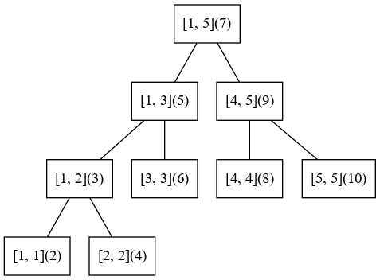
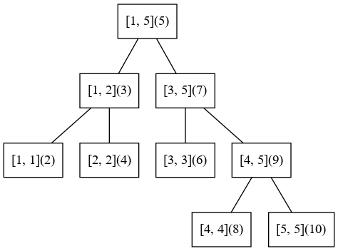

# 取中点相关技巧

## 不会溢出的取中点操作

https://zhuanlan.zhihu.com/p/144589742

https://www.zhihu.com/question/285586045/answer/481988416

## 恰好扫描数组一半的长度

对长度为n的数组, 扫描一半的长度, 直接用`n / 2`是不行的.  
但是`(n + 1) / 2`取开区间和`(n - 1) / 2`取闭区间都是可以的.

以取前半段为例, 直接给出表格, 自行观察一下.

| n的取值 | n为odd时              | n为even时             |
| ------- | --------------------- | --------------------- |
| n       | \[0, n / 2\]          | \[0, n / 2\)          |
| n \- 1  | \[0, \(n \- 1\) / 2\] | \[0, \(n \- 1\) / 2\] |
| n \+ 1  | \[0, \(n \+ 1\) / 2\) | \[0, \(n \+ 1\) / 2\) |

可以看到, 只要做1的偏移后, 区间的开闭情况对于odd和even就是统一的了.

原因在于, `+1`和`-1`的变化, 对于odd和even, 只会有1种变化产生影响. 那么变化之后方括号和圆括号就只剩1种了.

以上可以写成一个宏来方便遇到类似的情况不会使代码写错.

## 线段树使用2n空间, 直接根据区间端点算出结点编号

线段树(指普通版本)使用2n空间, 这是我会写指针版本线段树之后一直认为的很好的写法, 只要手动维护结点编号的分配即可.

什么, 你说zkw线段树? 那种东西并不够通用, 弃之.

但是, 指针版本的线段树, 需要保存左右结点的地址, 对于卡空间的出题人(2020计蒜之道初赛第三场)来说,  
他们应该是要卡掉普通版本的4n线段树和指针版本的2n线段树.

有一天我看到一份代码, 发现不需要手动维护结点编号, 也能做到2n空间的线段树, 而且是直接根据区间端点算出结点编号, 我当时就惊了, 还有这种操作.jpg.

https://paste.ubuntu.com/p/GYpJjz5489/

这个东西我不知道出处是哪里, 有知道的人可以告诉我一下.

---

我写了一个测试的程序: `src/test/seg2n_idx.cpp`.

我们先约定线段树中我们表示线段(区间)的端点形式是左闭右闭.

那么对于奇数段, 有2种划分子段的形式:

1. 多余的1个单位放在左边段.
2. 多余的1个单位放在右边段.

以上2种划分方式, 对应了线段树的2种编号方式.

直接看图, 然后找规律.

其中方括号内的数字代表线段树结点对应的区间, 圆括号内的数字代表线段树结点对应的编号.

不难发现, 圆括号里的数字大部分是用方括号里的数字左右端点加起来的结果, 除了奇数长度且长度大于1的区间的编号.  
这些区间恰好是奇数且能够继续往下划分的区间, 就对应了上面说的2种划分方式.  
那么这些区间的编号是怎么算出的呢?

这里直接给出结果, 不证明了.

1. 多余的1个单位放在左边段. 编号为区间端点相加再加1.
2. 多余的1个单位放在右边段. 编号为区间端点相加再减1.

